# Arcade-Darius2WarriorBlade_MiSTer

FPGA core for the Taito **dual-screen** arcade hardware targeting the
[MiSTer FPGA](https://github.com/MiSTer-devel) platform
(Terasic DE10-Nano). The core runs **Darius II** (dual screen), **Sagaia**
and **Warrior Blade — Rastan Saga Episode III**.

The board uses a single 68000 main CPU, a Z80 sound CPU with YM2610, two
TC0100SCN tilemap chips driving two screens side by side, two TC0110PR
palette/priority chips, and a sprite generator.

This core reimplements the hardware in SystemVerilog from MAME references
and hardware observation.

> This repository contains the full SystemVerilog source code, plus a
> pre-built bitstream and the parent MRA files in [releases/](releases/).
> You can also build the core yourself with Quartus (see *Building from
> source*).

## About the games

Taito built a small family of "wide" cabinets that spread the action across
several CRTs sitting side by side. The game that ties this family together is
**Darius II** (1989): it shipped on *two different* Taito wide boards — a
**three-screen** version (the *ninjaw* board) and the **two-screen** version
emulated here. The three-screen Darius II is available in a separate core;
this one is its two-screen counterpart, with each 320-pixel panel driven by
its own TC0100SCN tilemap chip and joined into a single 640-pixel image.

Three games shipped on this dual-screen board:

- **Darius II** (1989) — the horizontal shoot-'em-up with the branching
  stage map and the giant mechanical sea-life bosses. On two screens the
  Silver Hawk fights across a genuinely panoramic battlefield.
- **Sagaia** — the same game in its **World** revision, retitled for markets
  outside Japan.
- **Warrior Blade — Rastan Saga Episode III** (1991) — a fantasy
  beat-'em-up and the third chapter of the *Rastan* saga. Up to two players
  pick from Rastan, Dewey or Sophia and fight across the full width of both
  screens. Magic is cast through an allied wizard companion rather than a
  dedicated button — a quirk faithfully reproduced here.

Notably, *Darius II* and *Warrior Blade* share the very same dual-screen
board yet feel nothing alike — one a spaceship shooter, the other a
sword-and-sorcery brawler — which is exactly why a single core runs both.

## Status

**Current version: 1.0** (2026).

The core runs all three games end-to-end and has been tested on real
MiSTer hardware.

**Planned for a future release:**
- Savestate support (ssbus infrastructure already in place)

**Features**
- M68000 main CPU (FX68K core) — single 68000
- Z80 sound CPU (T80) with Taito TC0140SYT main↔sound communication
- Two TC0100SCN tilemap chips (MAME-accurate): BG0, BG1 with per-row scroll
  and per-column scroll, plus the FG0 text layer
- Two TC0110PR palette / priority chips
- Sprite renderer with priority, flip, buffered sprite RAM
- Audio: YM2610 (FM + SSG + ADPCM-A/B) via JT12, MSM5205 via JT5205
- Dual-screen composition (two 320-pixel panels side by side)
- Graphics and audio data streaming through a multi-port SDRAM controller
- Additional graphics/audio data backed by DDR3
- VBlank-synchronized pause (frame-aligned, no race conditions)
- MiSTer OSD with video and DIP options

**Games supported**
- Darius II (Japan, dual screen)
- Sagaia (World, dual screen)
- Warrior Blade — Rastan Saga Episode III (Japan)

## Screenshots

### Darius II

| | |
|---|---|
| 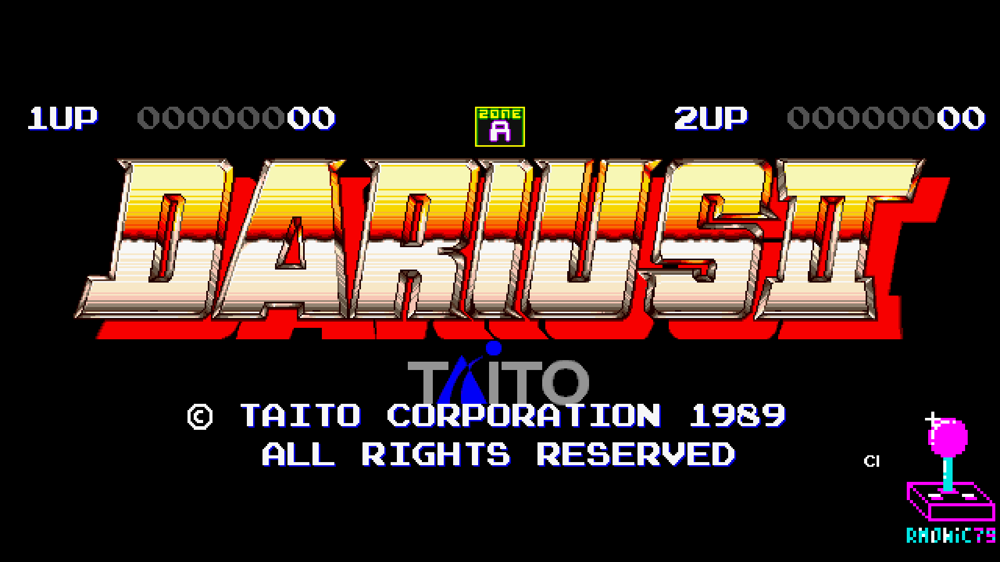 | 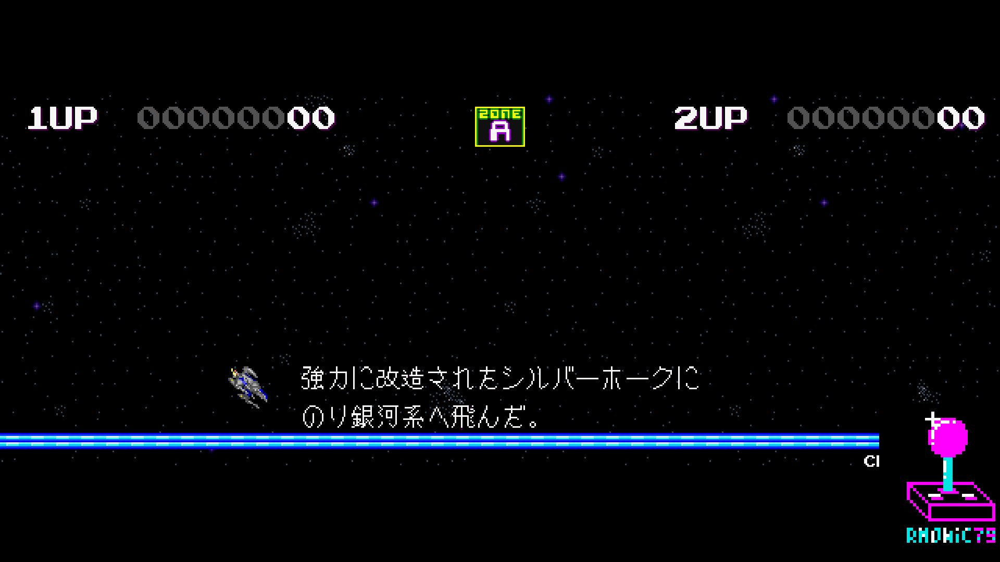 |
| 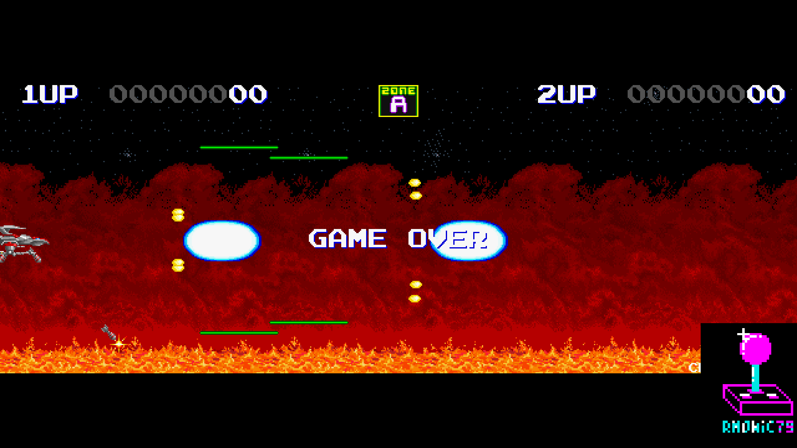 | 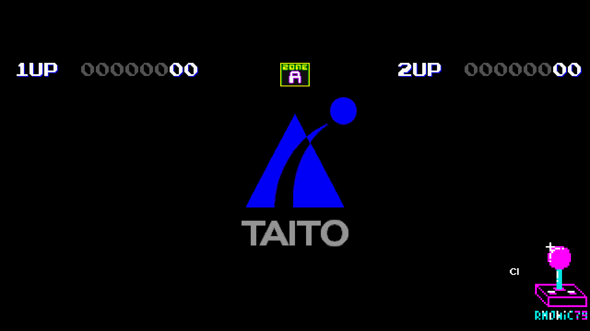 |

### Sagaia

| | |
|---|---|
| 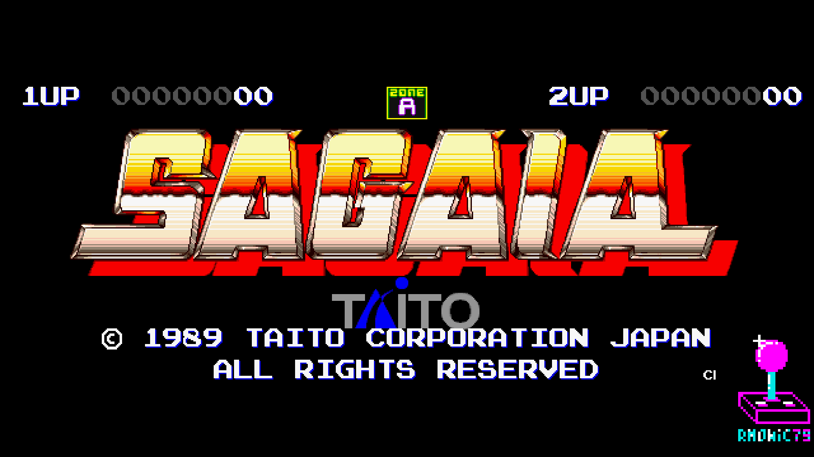 | 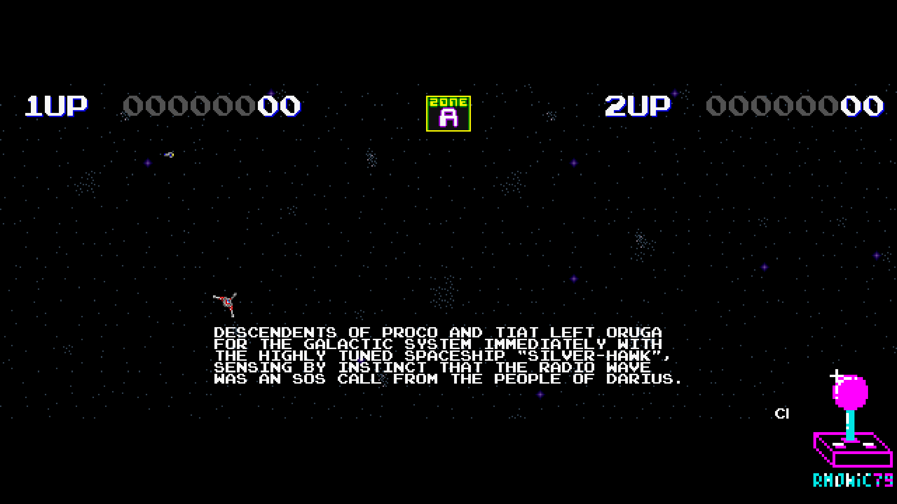 |
| 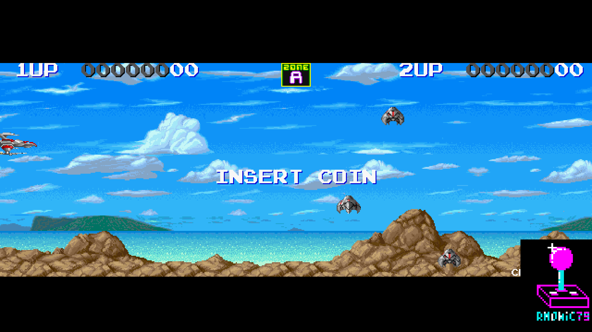 | |

### Warrior Blade — Rastan Saga Episode III

| | |
|---|---|
| 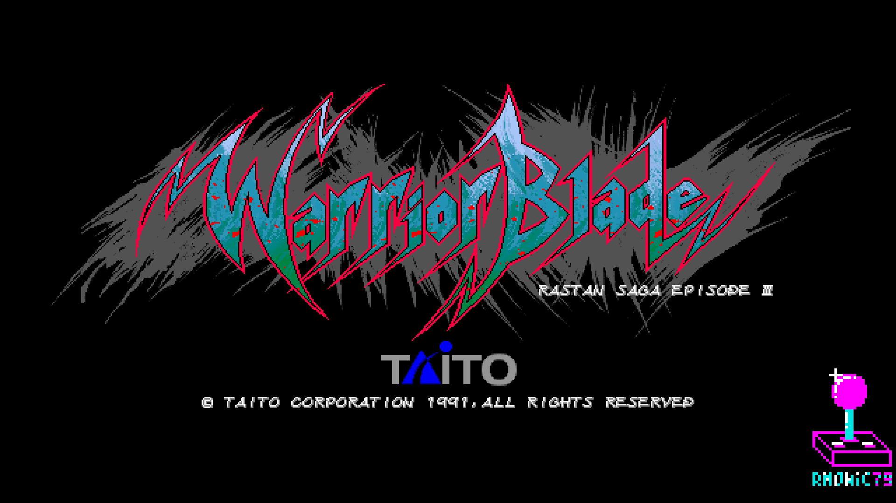 | 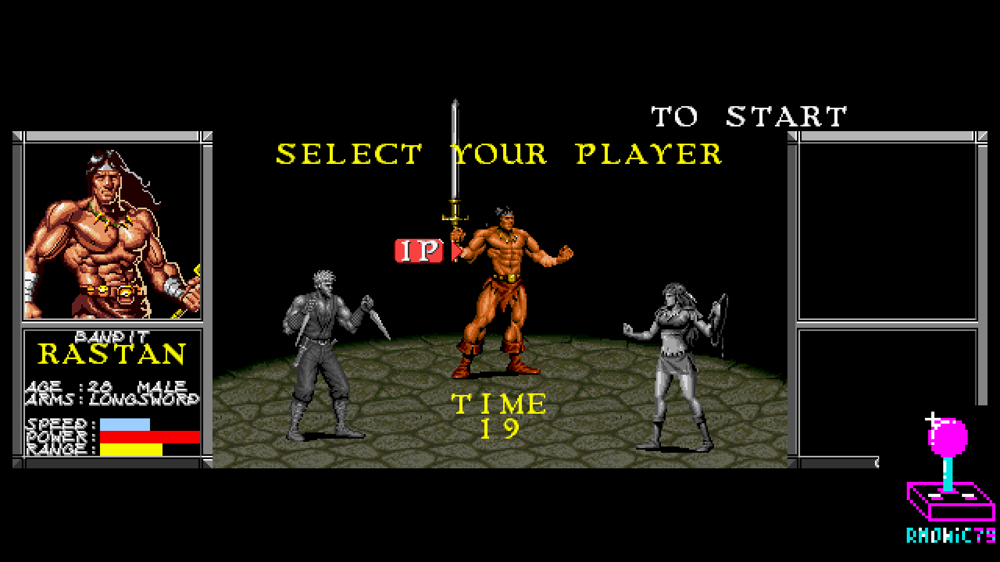 |
| 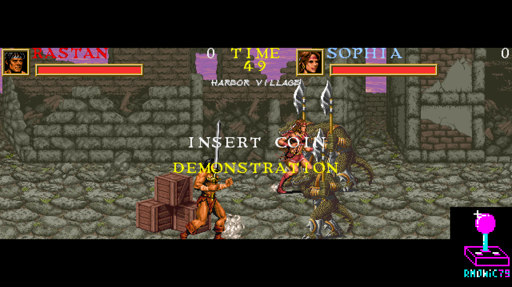 | 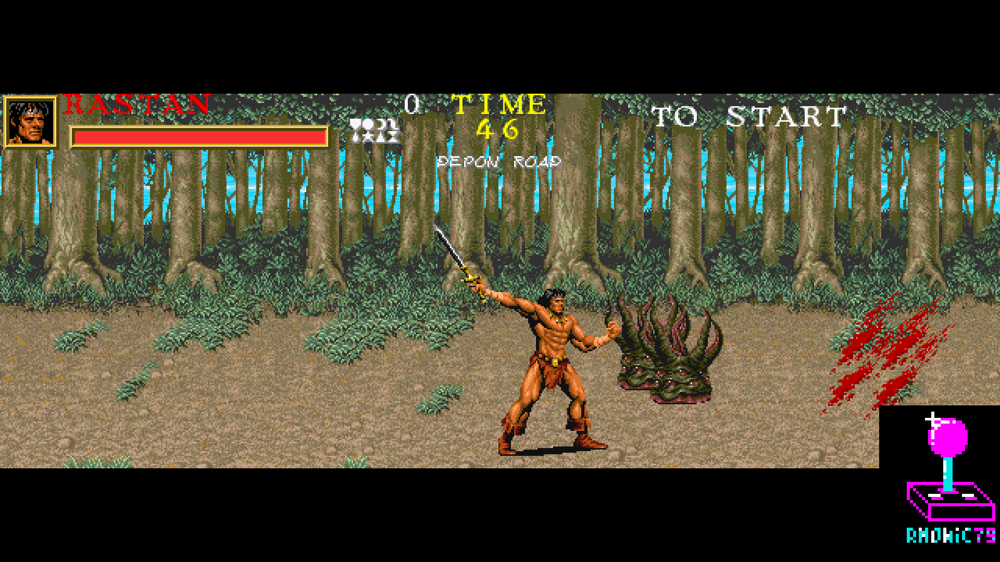 |

## Hardware emulated

| Component        | Spec                                                |
|------------------|-----------------------------------------------------|
| Main CPU         | M68000 (FX68K)                                       |
| Sound CPU        | Z80 (T80)                                            |
| Sound chip       | Yamaha YM2610 (FM + SSG + ADPCM-A/B, jt12)           |
| ADPCM            | OKI MSM5205 (jt5205)                                 |
| Sound comm       | Taito TC0140SYT                                      |
| Tilemaps         | TC0100SCN ×2 (dual screen, BG0/BG1/FG0)              |
| Palette / prio   | TC0110PR ×2                                          |

## Hardware requirements

- Terasic DE10-Nano
- MiSTer I/O board (recommended)
- SDRAM module (32 MB or 64 MB)
- DDR3 memory (built into DE10-Nano)
- Works on HDMI displays and on CRTs via the analog video output

## Building from source

Requires Quartus Prime 17.0 (free Lite Edition).

```
Open Darius2WarriorBlade.qpf in Quartus → Processing → Start Compilation
```

Output bitstream is generated in `output_files/Darius2WarriorBlade.rbf`.

## Running on MiSTer

The [releases/](releases/) folder contains the pre-built bitstream and the
parent MRA files for all three games:

- `Darius2WarriorBlade_YYYYMMDD.rbf` — pre-built core bitstream
- `Darius II (Japan, dual screen, rev 2).mra` — Darius II parent MRA
- `Sagaia (World, dual screen).mra` — Sagaia parent MRA
- `Warrior Blade (Japan).mra` — Warrior Blade parent MRA

Alternative ROM sets are provided in
[releases/alternatives/](releases/alternatives/):

- `Darius II (Japan, dual screen, rev 1).mra` — darius2do (earlier revision)

Steps:

1. Copy the `.rbf` to `_Arcade/cores/` on the MiSTer SD card.
2. Copy the desired `.mra` file(s) to `_Arcade/` on the MiSTer SD card.
3. Provide your legally-owned ROM files where each MRA expects them
   (usually in `games/mame/`).

**ROMs are NOT included in this repository.** You must provide them yourself.

## Repository layout

```
Arcade-Darius2WarriorBlade_MiSTer/
├── rtl/
│   ├── darius2/   Darius II / Warrior Blade core RTL (TC0100SCN, TC0110PR,
│   │              TC0140SYT, sprite renderer, memory maps, audio, bridges)
│   ├── fx68k/     FX68K M68000 cycle-accurate core
│   ├── t80/       Z80 sound CPU
│   ├── jt12/      YM2610 / YM2203 FM + SSG + ADPCM
│   ├── jt5205/    MSM5205 ADPCM
│   ├── jtframe/   JTFRAME framework helpers
│   ├── pll/       Clock PLL
│   └── sdram.sv   SDRAM controller (Sorgelig)
├── sys/                    MiSTer framework (Sorgelig / MiSTer-devel)
├── logo/                   Pause overlay assets
├── docs/                   Screenshots
├── releases/         Pre-built .rbf + parent MRA files (all three games)
│   └── alternatives/ MRA files for alternate ROM sets (Darius II rev 1)
├── Darius2WarriorBlade.qpf Quartus project
├── Darius2WarriorBlade.qsf Quartus assignments
├── Template.sv             Top-level wrapper
├── Template.sdc            Timing constraints
├── files.qip               HDL file list
└── README.md               This file
```

## Acknowledgements

- **Jose Tejada** ([@jotego](https://github.com/jotego)) for JT12 (YM2610),
  JT5205 (MSM5205) and the JTFRAME framework.
- **Jorge Cwik** ([ijor](https://github.com/ijor)) for the **FX68K**
  cycle-accurate M68000 core.
- **Martin Donlon** ([wickerwaka](https://github.com/wickerwaka)) for the
  Taito F2 core: the TC0140SYT sound-comm chip and the savestate bus
  layout used here come from that work, and his F2 hardware analysis was a
  foundational reference for composing this core.
- The **MAMEDev team** for the invaluable reference on the TC0100SCN
  tilemaps, TC0110PR palette/priority, memory maps and timing.
- **Sorgelig** and the **MiSTer-devel team** for the framework, SDRAM
  controller and Template.

## Support this project

If you enjoy this core and want to support its development:

- [Ko-fi](https://ko-fi.com/ibecerivideoludici) — one-time support
- [Patreon](https://www.patreon.com/IBeceriVideoludici) — monthly support
- [PayPal](https://www.paypal.me/IBeceriVideoludici) — one-time donation

## Follow

- [GitHub](https://github.com/rmonic79)
- [Twitch](https://twitch.tv/ibecerivideoludici) — live streams
- [YouTube](https://www.youtube.com/c/IBeceriVideoludici) — playlists and videos
- [X / Twitter](https://x.com/rmonic79)

## License

The RTL source code in this repository is provided as-is for educational
and preservation purposes under **GNU GPL v3 or later**. ROM data is not
included; users must provide their own.

Original *Darius II* / *Warrior Blade — Rastan Saga Episode III* arcade
hardware © Taito Corporation.
